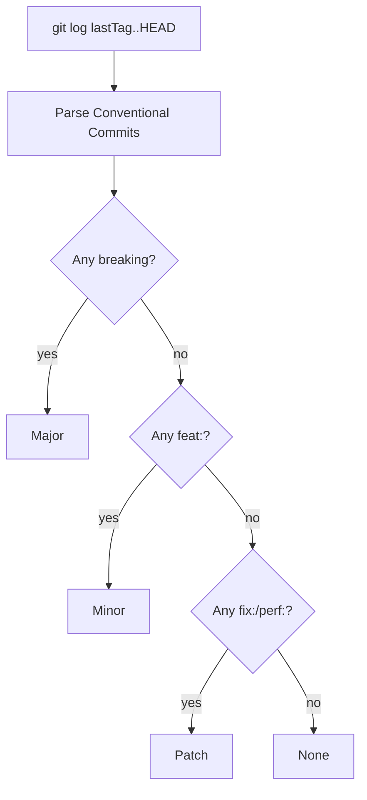

> ⚠️ **DEPRECATED — v0.1 archived 2026-04-30.**  This repo was a portfolio exercise. After a 12-iteration / 27-domain competitive analysis, the recommended production path is:
>
> **release-please** (https://github.com/googleapis/release-please-action) — GitHub-verified · **git-cliff** (https://github.com/orhun/git-cliff) — Rust changelog generator
>
> The code below remains available for reference but is **no longer maintained**. See the linked alternatives for production use.

# flowtag

> **Conventional Commits → semver bump + auto-CHANGELOG + draft release notes.** Single Go binary, zero deps, works as a GitHub Action OR a local CLI. Modular bump rules. Drop-in for any repo, any language.

[](https://github.com/M00C1FER/flowtag/actions)


## What it does

Parses commits since the last tag and:
1. **Computes the next semver bump** — any `BREAKING CHANGE:` (or `!:` marker) → major; any `feat:` → minor; only `fix:`/`perf:` → patch; only docs/chore → no bump.
2. **Renders a Keep-a-Changelog markdown entry** — sections grouped by Breaking / Features / Fixes / Performance / Refactors / Docs / Tests / Maintenance.
3. **Prepends `CHANGELOG.md`** with the new entry (or prints to stdout for piping).

The release publisher (tagging + GitHub Release draft) is in v0.2 — v0.1 is read-only or write-changelog. This deliberate scoping lets flowtag be safely composed with other release tooling without overstepping.

## Why this exists

Existing semver-automation tools (`semantic-release`, `release-please`) are Node-only, Google-flavored, or both. **flowtag is a single 6 MB Go binary with zero dependencies** — it works in any GH runner, any container, any pre-commit hook, any local shell. No `npm install`, no Python interpreter, no Docker layer.

## Quick start

### Local CLI

```bash
go install github.com/M00C1FER/flowtag/cmd/flowtag@latest

flowtag --bump            # → minor
flowtag --next-version    # → v0.2.0
flowtag --changelog       # markdown to stdout
flowtag --write-changelog # prepend CHANGELOG.md
```

### GitHub Action

```yaml
on: { push: { branches: [main] } }
jobs:
  release:
    runs-on: ubuntu-latest
    steps:
      - uses: actions/checkout@v4
        with: { fetch-depth: 0, fetch-tags: true }
      - uses: M00C1FER/flowtag@v0.1.0
        with:
          mode: write-changelog       # or: next-version | bump | changelog
```

## How a bump is computed



The breaking detector recognizes both forms in the [Conventional Commits 1.0 spec](https://www.conventionalcommits.org):
- `feat!: drop /v1` (exclamation after type/scope)
- A `BREAKING CHANGE: <text>` footer in the body

## Bump rule customization

Defaults map standard Conventional types:

| Type | Bump |
|---|---|
| `feat` | minor |
| `fix`, `perf`, `revert` | patch |
| `refactor`, `docs`, `style`, `test`, `chore`, `build`, `ci` | none |
| **breaking** (any type) | **major** |

You can override the mapping in v0.2 via `flowtag --rules my-rules.yaml`. v0.1 ships with the defaults compiled in.

## Comparison vs alternatives

| Tool | Lang | Single binary | Modular rules | GH Action | Conventional Commits |
|---|---|:-:|:-:|:-:|:-:|
| `semantic-release` | Node.js | ❌ (npm install + plugins) | ✅ | via wrapper | ✅ |
| `release-please` (Google) | Node.js | ❌ | partial | ✅ | ✅ |
| `git-cliff` | Rust | ✅ | ✅ | ✅ | ✅ |
| **`flowtag`** | **Go** | **✅** | **✅ (v0.2)** | **✅** | **✅** |

`git-cliff` is the closest match in spirit; flowtag's differentiator is the simpler scope (no template engine, no plugin system) and tighter integration with Go-Action runners.

## Testing

```bash
go test ./...
```

15 tests cover Conventional Commits parsing (incl. scoped, breaking via `!`, breaking via footer), bump computation across all kinds, and CHANGELOG rendering.

## Cross-platform support

| Platform | Install method | Notes |
|---|---|---|
| **Debian 12/13, Ubuntu 22.04/24.04** | `go install` or `install.sh` | `apt install golang-go` if Go absent |
| **Arch / Manjaro** | `go install` or `install.sh` | `pacman -S go` |
| **Fedora / RHEL / Rocky** | `go install` or `install.sh` | `dnf install golang` |
| **Alpine** | `go install` or `install.sh` | `apk add go`; glibc not required (pure Go) |
| **WSL2 (Ubuntu)** | same as Ubuntu | no `/sys/firmware/efi` assumptions |
| **Termux (Android arm64)** | `pkg install golang && go install github.com/M00C1FER/flowtag/cmd/flowtag@latest` | `install.sh` also detects Termux automatically |

## Roadmap

- v0.2: YAML bump-rule overrides; GitHub Release publisher
- v0.3: GitLab + Gitea publishers
- v0.4: Multi-repo monorepo mode (per-package versioning)

## License

MIT.
